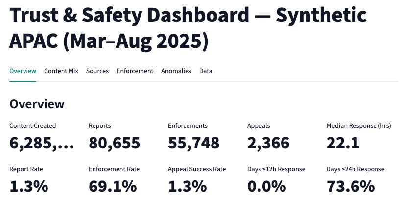
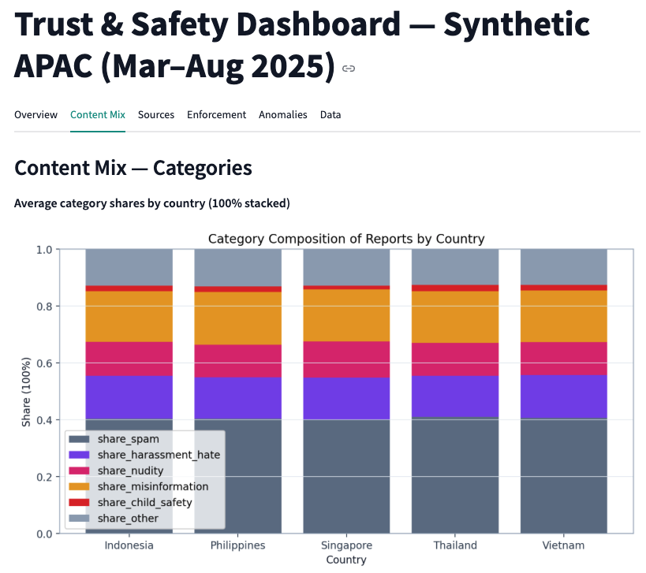
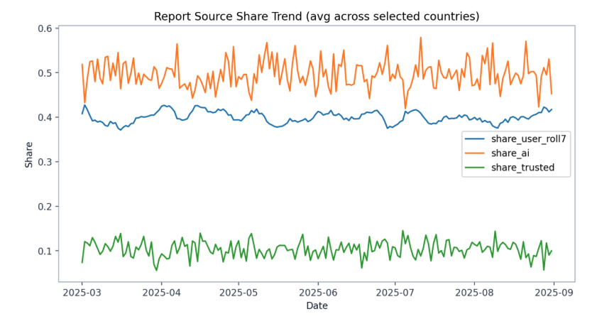
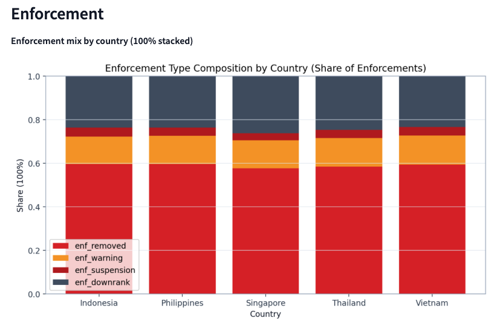
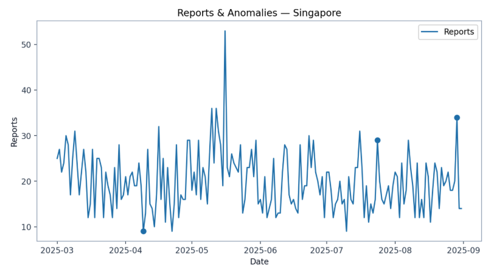

# Trust & Safety Analytics Case Study (Synthetic Data)

This project simulates the work of a **Trust & Safety Analyst at a social media platform**.  
It demonstrates how to generate and analyze moderation data, track KPIs, detect anomalies, and design a **dashboard prototype** to communicate insights.

---

## 🔑 Why This Project Matters

This case study highlights **baseline Trust & Safety analytics skills**:

- 📊 Built a **synthetic dataset** (APAC, daily 6 months) with realistic T&S patterns.
- 📈 Developed an **analysis pipeline**: KPIs, descriptive outputs, anomaly detection.
- 🖥️ Designed a **Streamlit dashboard prototype** with KPI cards, content/source/enforcement mixes, and anomaly tab.
- 💡 Produced **executive-style insights & recommendations** from the data.

This shows both **domain interest** and **technical capability** for a Trust & Safety Analyst role.

---

## 📸 Sample Outputs

### Dashboard Prototype (Screenshots)

_Note: Dashboard is not deployed, screenshots are provided as demonstration._

- **Overview KPIs & Trends**  
  

- **Category Mix (100% stacked) & Misinformation Trend**  
  

- **Report Sources Trend**  
  

- **Report Enforcement Type Mix**  
  

- **Anomalies (z-score detection)**  
  

---

## 📊 Dataset

- **Period:** March–August 2025 (6 months daily)
- **Countries:** Singapore, Indonesia, Philippines, Thailand, Vietnam

**Columns (aggregated daily per country):**

- **Core totals:** `date`, `country`, `active_users`, `content_created`, `reports`, `enforcements`, `appeals`, `successful_appeals`, `median_response_time_hours`
- **Category counts:** spam, harassment/hate, nudity, misinformation, child safety, other
- **Source counts:** user, AI, trusted flaggers
- **Enforcement type counts:** removal, warning, suspension, downrank
- **Derived KPIs:** report_rate, enforcement_rate, appeal_rate, appeal_success_rate
- **Derived shares:** category shares, source shares

**Realistic patterns encoded:**

- **Spam surge** → spikes in `reports_spam` and total reports.
- **Misinformation event (Jul 2025)** → surge in misinformation share.
- **Source mix varies by category:** spam/nudity → AI; harassment/hate → user/trusted; misinformation → user.
- **Enforcement varies by category:** misinformation → downrank; child safety → removal/suspension only.
- **Appeals**: success depends on category + source.
- **SLA trend**: response time improves gradually across months.

---

## 🚀 Running the Project

### Modular Python Pipeline

```
pip install -r requirements-analysis.txt
python -m src.main
```

Pipeline outputs:

- Synthetic dataset → `data/tiktok_ts_apac_daily.csv`
- Country KPI summary → `data/country_kpis.csv`
- Descriptive CSVs → `data/desc_*.csv`
- Visuals → `images/`
- Anomalies → `data/anomalies_window7_z2.csv`

### Streamlit Dashboard (Interactive Prototype)

```
streamlit run dashboard/ts_dashboard_app.py
```

Features:

- KPI cards (content, reports, enforcement, appeals, response time)
- Category, source, and enforcement **mixes** (100% stacked bars)
- Daily trends (reports, misinformation share, source share)
- Anomalies tab (z-score detection, adjustable window/threshold)
- Filterable data table + CSV export

---

## 📑 Deliverables

- **Dataset** → `data/tiktok_ts_apac_daily.csv`
- **Dashboard** → `dashboard/ts_dashboard_app.py`
- **Python Package (`src/`)** → modular scripts to reproduce analysis

---

## 🔎 Key Insights (synthetic data, executive summary)

- Reports = ~1.2% of content; moderation load is steady but sensitive to surges.
- Enforcement coverage is strong (~73%), but **appeal outcomes vary widely** across countries.
- **Misinformation spikes** in July, mostly user-reported and downranked, highlight event-driven risks.
- **Child safety reports are rare but strictly enforced** (removal/suspension, 0% appeal success).
- Response times trend downward (~18h → ~14h) but still exceed **12h SLA target**.

---

## 💡 Recommendations

- **Consistency:** standardize appeals handling across countries.
- **Speed:** target <12h median response, prioritizing high-severity categories.
- **Proactivity:** invest in early detection for misinformation and spam surges.
- **Transparency:** report source mix + enforcement mix to improve stakeholder trust.

---

## 🎯 Purpose

This project was built to **show transferable skills** for a role in Trust & Safety analytics.  
It demonstrates:

- Data analysis & visualization
- KPI tracking & anomaly detection
- Dashboard prototyping
- Executive-level storytelling

---
