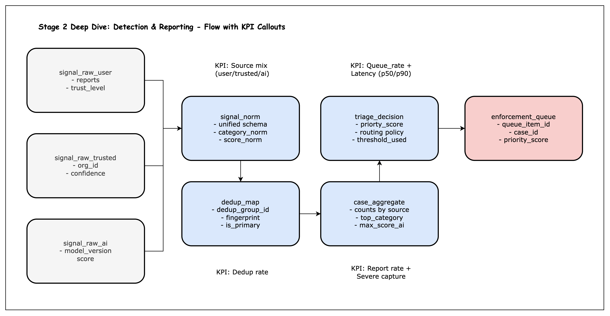

# Stage 2 A/B Test Design (with Deep Dive & Simulation)

This project demonstrates the ability to **design an A/B test for Trust & Safety systems**, with supporting context from a **Stage 2 (Detection & Reporting) deep dive** and a **synthetic simulation pipeline**.  
The primary focus is on **experiment design**—showing how parameters, metrics, and analysis methods are chosen.  
The Stage 2 schema and simulator serve as supporting elements to ground the experiment in realistic data.

---

## 🔑 Executive Summary

- **Primary purpose** → Showcase **A/B test design ability** in Trust & Safety.
- **Supporting work** → Stage 2 flow/schema (for context) + simulation pipeline (to execute and validate).
- **Deliverables** → Experiment design write-up, schema reference, synthetic data generator, HTML report.

---

## ⚖️ Why A/B Testing Matters in Trust & Safety

A/B testing is critical in Trust & Safety because interventions (e.g., threshold changes, new detection weights) directly affect:

- **User safety outcomes** (capturing severe harms)
- **Reviewer workload** (queue size, latency)
- **Fairness & accuracy** (appeals, precision)

A well-designed experiment ensures new policies improve safety **without unintended side effects**.

---

## 🧪 Experiment Design (Primary Focus)

### Unit of Randomization

- **Case-level randomization** → all signals for a piece of content stay in the same arm.
- Prevents inconsistent outcomes across signals on the same content.

### Arms

- **Arm A (baseline)** → current triage threshold and weights.
- **Arm B (treatment)** → lower AI thresholds, increased weights for severe categories (child safety, hate).

### Metrics

- **Primary KPI** → Severe-case capture (% of high-severity cases queued).
- **Secondary** → Precision proxy (enforced / queued).
- **Guardrails** → Queue rate (capacity), latency (p50/p90), appeal success (false positives).

### Sample Size Rationale

- Baseline precision ≈ 0.72.
- Target improvement = +4pp (to 0.76).
- α = 0.05 (significance), power = 0.8.
- → Requires ~2,000 cases per arm.

### Analysis Methods

- **Proportion test (z-test)** → compare severe capture, precision.
- **Logistic regression** → control for confounders (country, category).
- **Mann–Whitney U** → compare latency distributions (robust to skew).

---

## 🧱 Stage 2 Deep Dive (Supporting Context)

Stage 2 of the Trust & Safety pipeline covers **Detection & Reporting**:

1. Signal generation (users, AI, trusted flaggers)
2. Normalization into schema
3. Deduplication of signals
4. Case aggregation
5. Triage decision (priority, threshold)
6. Queue or monitoring

📄 See full schema and KPIs: [`docs/schema.md`](docs/schema.md)



---

## 🖥 Simulation & Report (Execution)

Since real moderation data is unavailable, a **synthetic simulator** was built:

- Generates fake cases with category, AI score, threshold assignment, enforcement, appeals.
- Randomly assigns arms (A/B) at case-level.
- Applies thresholds & weights to simulate queueing outcomes.
- Produces dataset + analysis-ready CSV.

### Run the Simulator

```bash
python src/simulate_ab
```

### Generate Report

```bash
python src/make_report
```

Outputs:

- 📄 **HTML report** → `reports/abtest_report.html`
- 📊 **KPI chart** → `images/abtest_metrics.png`

The report includes KPIs, z-tests, logistic regression, Mann–Whitney results.

---

## 📂 Project Structure

```
mini_project3_abtest/
│── data/                # Synthetic datasets
│── docs/                # Detailed schema (stage 2)
│── images/              # Charts & diagrams
│── reports/             # HTML reports
│── src/                 # Python scripts
│   │── simulate_ab.py   # Synthetic data generator
│   │── make_report.py   # Report generator (HTML + PNG)
│   │── config.py        # Parameters (thresholds, weights, sample size)
│── README.md            # (this file)
```

---

## 📑 Deliverables

- **Experiment design** (this README)
- **Stage 2 schema** (`docs/schema.md`)
- **Synthetic dataset** (`data/abtest_synthetic.csv`)
- **A/B test HTML report** (`reports/abtest_report.html`)
- **KPI chart** (`images/abtest_metrics.png`)
- **Python package (`src/`)** to reproduce everything

---

## 🎯 Purpose

This mini-project highlights:

- **Design skills** → framing hypotheses, KPIs, sample size, guardrails.
- **Domain knowledge** → Stage 2 schema & KPIs in moderation.
- **Execution** → synthetic simulator + statistical tests.

👉 The **A/B test design** is the centerpiece. Stage 2 context and simulation demonstrate the ability to ground design in realistic systems and validate outcomes, even without real-world data.
