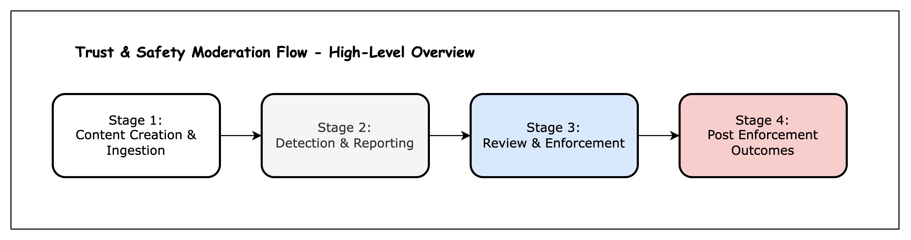
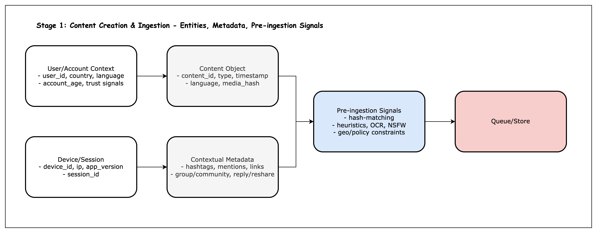
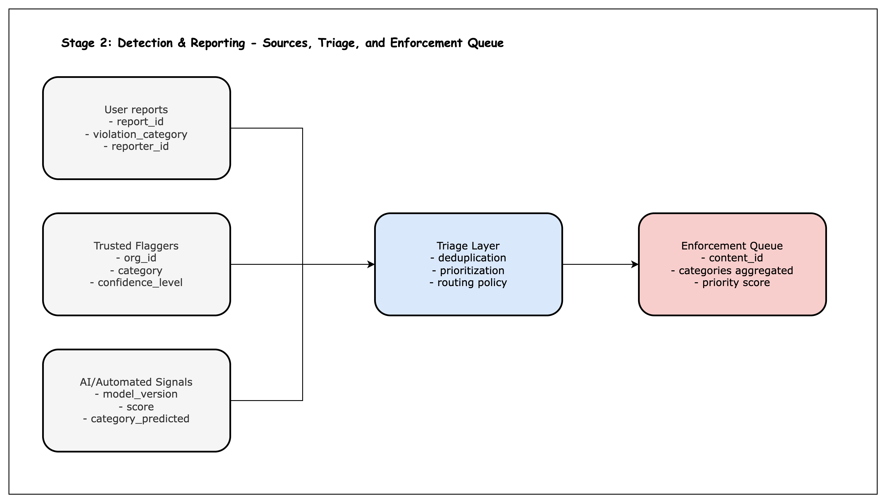
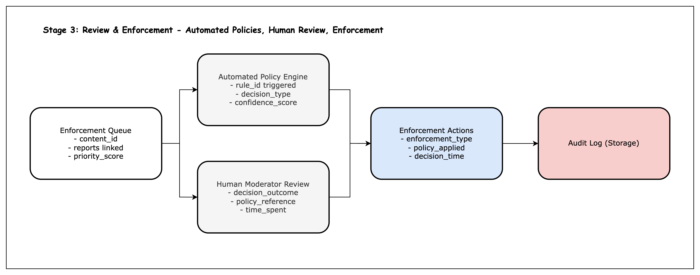
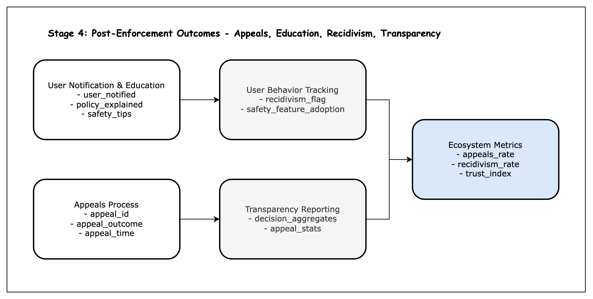

# Trust & Safety Moderation Data Flow — Conceptual Case Study

This project maps the **end-to-end flow of data in Trust & Safety operations** for a social media platform.  
It highlights how **content moves through moderation stages**, the **data dimensions** captured at each step, and the **KPIs** that can be monitored.

---

## 🔑 Summary

This project demonstrates:

- An understanding of the **big picture in Trust & Safety**: from content creation to post-enforcement outcomes.
- The ability to **structure complex processes** into stages with **clear data and KPIs**.
- Skills in **communicating complexity simply** — essential for Trust & Safety analysts and data roles.
- A foundation for future projects that **drill down into individual stages** (e.g., Detection & Reporting with A/B tests).

---

## 🌐 Overview Diagram

The moderation pipeline has **four main stages**:

1. **Content Creation & Ingestion** — users create content, devices log metadata, pre-ingestion signals applied.
2. **Detection & Reporting** — flags raised by users, trusted flaggers, or AI; triage aggregates into enforcement queue.
3. **Review & Enforcement** — decisions made by automated policy engine or human moderators; enforcement actions logged.
4. **Post-Enforcement Outcomes** — appeals, user education, recidivism tracking, and transparency reporting.

---

## Stage 1: Content Creation & Ingestion

### What happens

- Users (and their devices) generate content.
- Metadata and contextual information are attached.
- Lightweight pre-ingestion safety checks run (e.g., hash-matching, NSFW detection).

### Data dimensions

- User/account context: `user_id`, `account_age_days`, `country`, trust signals.
- Device/session: `device_id`, `ip`, `session_id`, `app_version`.
- Content object: `content_id`, `content_type`, `timestamp`, `language_detected`, `media_hash`.
- Metadata: hashtags, mentions, links, group/community info.
- Pre-ingestion signals: `hash_match_csam`, `nsfw_prob`, `spam_score`.

### KPIs

- Content volume (`content_created`).
- Metadata coverage (% with language/media hash).
- Risk exposure proxies (% new accounts, % with links).
- SLA prep: normalization for later report_rate.

### What good looks like

- IDs unique, timestamps valid.
- Metadata completeness high.
- Pre-ingestion signals consistently applied.

---

## Stage 2: Detection & Reporting

### What happens

- Content flagged by **user reports**, **trusted flaggers**, or **AI models**.
- Reports aggregated and deduplicated in a **triage layer**.
- High-priority cases routed to enforcement queues.

### Data dimensions

- User reports: `report_id`, `reporter_id`, `violation_category`, `reason_text`.
- Trusted flaggers: `org_id`, `confidence_level`.
- AI/Automated: `model_version`, `score`, `category_predicted`.
- Triage: `priority_score`, `deduplication_group_id`, `routing_policy`.

### KPIs

- Report rate, source mix (% user vs AI vs trusted).
- Deduplication rate.
- Triage-to-queue latency.
- AI model coverage.

### What good looks like

- Duplicates reduced.
- High-severity routed fast.
- AI decisions logged with model version.

---

## Stage 3: Review & Enforcement

### What happens

- Content in enforcement queue handled by **automated policy engine** or **human moderators**.
- Actions: removal, warning, suspension, downrank.
- All decisions logged for auditing.

### Data dimensions

- Queue: `queue_id`, `priority_score`.
- Policy engine: `rule_id_triggered`, `decision_type`, `confidence_score`.
- Moderator review: `moderator_id`, `decision_outcome`, `policy_reference`.
- Enforcement: `enforcement_type`, `policy_applied`, `decision_time`, `appeal_allowed`.
- Audit log: immutable `decision_record_id`.

### KPIs

- Decision time latency.
- Auto-policy coverage vs manual review.
- Moderator agreement rate.
- Enforcement mix (% removals vs warnings).

### What good looks like

- Timely decisions, especially for high-harm.
- Balanced automation vs human oversight.
- Complete audit trail.

---

## Stage 4: Post-Enforcement Outcomes

### What happens

- Users notified and educated about enforcement.
- Appeals process enables fair contestation.
- User behavior tracked for recidivism and feature adoption.
- Transparency reports aggregate outcomes.

### Data dimensions

- Notification: `user_notified`, `policy_explained`.
- Appeals: `appeal_id`, `appeal_outcome`, `appeal_time`.
- Behavior tracking: `recidivism_flag`, `safety_feature_adoption`.
- Transparency reporting: enforcement breakdowns, appeal stats.

### KPIs

- Appeal rate, appeal success rate.
- Recidivism rate.
- Adoption of safety features.
- Transparency coverage and timeliness.

### What good looks like

- Clear communication.
- Fair, timely appeals.
- Behavior change post-enforcement.
- Accountability through transparency.

---

## 🎯 Conclusion

This project demonstrates the ability to **map complex Trust & Safety processes into structured data and KPIs**, and to communicate them clearly with diagrams and executive-friendly explanations.

It sets the stage for deeper drill-down projects, beginning with **Stage 2: Detection & Reporting**, which will explore detailed columns, realistic patterns, and even **A/B testing experiments**.

---
